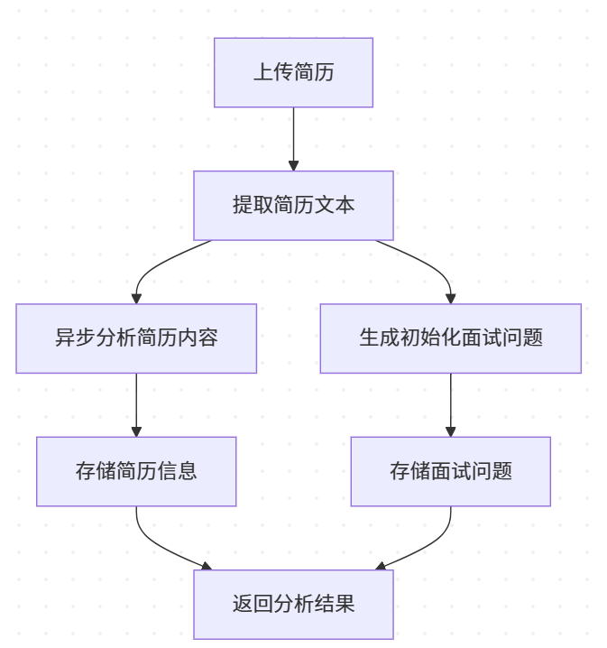
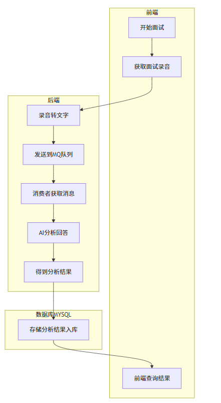

# AI 面试助手系统

## 项目简介
这是一个基于 AI 的智能面试助手系统，可以帮助面试官进行简历分析、生成面试问题，并提供面试评估功能。系统支持简历解析、智能问答、语音转写、AI 评估等功能。

## 技术栈
- 后端：Python + Flask
- 数据库：MySQL
- 消息队列：RabbitMQ
- AI 服务：ChatGPT API
- 文件存储：AWS S3
- 音视频处理：FFmpeg
- 语音识别：阿里云智能语音交互

## 项目结构
```
my_flask_app/
├── app/
│   ├── controllers/        # 控制器层
│   ├── services/          # 服务层
│   ├── dao/              # 数据访问层
│   ├── models/           # 数据模型
│   ├── utils/            # 工具类
│   ├── dto/              # 数据传输对象
│   └── consumer/         # 消息队列消费者
├── config.py             # 配置文件
├── requirements.txt      # 项目依赖
└── run.py                # 启动文件
└── .env                  # 本地配置文件
└── worldai.sql           # 数据库结构
```

## 使用步骤

1. 克隆项目
```bash
git clone https://github.com/SA020704/interview.git
cd my_flask_app
```

2. 创建虚拟环境
```bash
python -m venv venv
source venv/bin/activate  # Linux/Mac
venv\Scripts\activate     # Windows
```

3. 安装依赖
```bash
pip install -r requirements.txt
```

4. 初始化数据库(Mysql)
```
下载安装MYSQL:https://www.mysql.com/cn 
(个人推荐用小皮面板中自带的MYSQL环境)
创建数据库worldAI并且导入数据库表结构 my_flask_app/worldai.sql
```

5. 下载ffmpeg
```
https://ffmpeg.org/
```

6. 安装RabbitMQ(个人推荐使用docker安装)
```
https://www.rabbitmq.com/
```

7. 配置环境变量
创建 `.env` 文件并配置自己对应的参数：
```
#亚马逊S3云存储
AWS_ACCESS_KEY_ID=xxx
AWS_SECRET_ACCESS_KEY=xxx
S3_BUCKET_NAME=xxx
S3_BASE_URL=xxx

#阿里云智能语音交互
ALIYUN_AK_ID=xxx
ALIYUN_AK_SECRET=xxx
NLS_APP_KEY=xxx

#RabbitMQ
MQ_QUEUE_NAME=xxx
MQ_LOCALHOST=xxx
MQ_PORT=xxx
MQ_USERNAME=xxx
MQ_PASSWORD=xxx

#Ffmpeg
WINDOWS_PATH=xxx
MAC_PATH=xxx

#Mysql
MYSQL_HOST=xxx
MYSQL_PORT=xxx
MYSQL_USERNAME=xxx
MYSQL_PASSWORD=xxx
MYSQL_DATABASE=xxx

#Gpt代理(这个是ms内部的gpt代理)
GPT_PROXY_KEY=xxx
GPT_API_URL=xxx
```

8. 启动 Flask 应用
```bash
python run.py
```

## 系统流程

### 1. 简历分析流程


### 2. 面试评估流程


## 关键API 接口文档:
```
https://apifox.com/apidoc/shared/3270b191-f31e-47fc-8825-a802dd393fd5
```


## 注意事项

1. 确保已安装并启动 MySQL 服务
2. 确保已安装并启动 RabbitMQ 服务
3. 必须要.env文件,.env一定要在根目录下，并且填好自己对应的信息
4. 确保 FFmpeg 已正确安装并配置可执行文件的正确路径
5. 确保 AWS S3 凭证配置正确
6. 确保阿里云语音服务配置正确